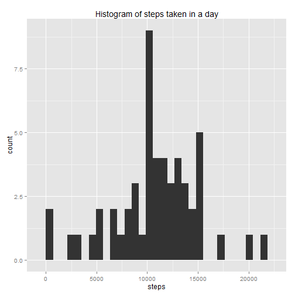
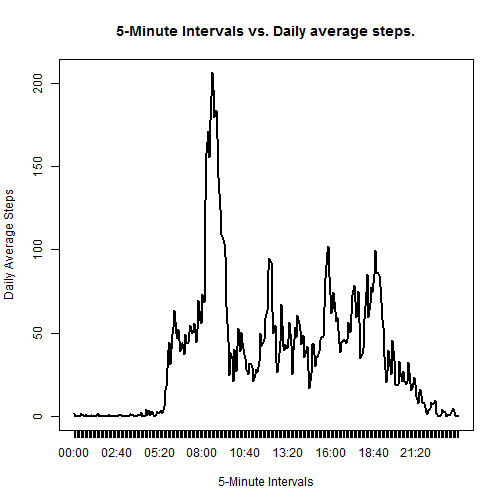
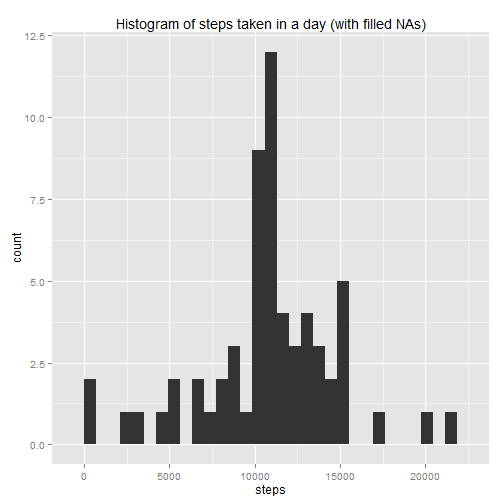
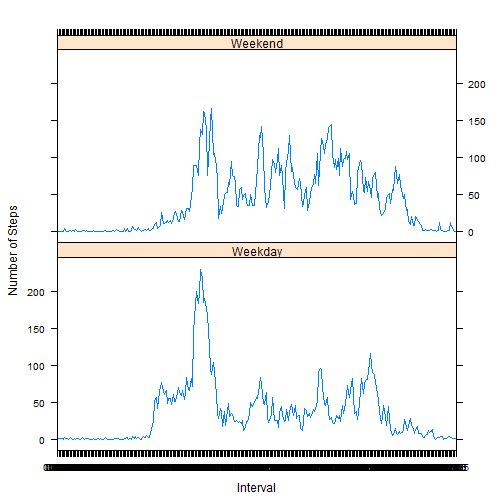

Reproducible Research - Peer Assessment 1
================================================

### Setting global options with echo=TRUE.


```r
library(knitr)
opts_chunk$set(echo=TRUE)
```

###1) Loading and preprossessing data.


```r
activity = read.csv("activity.csv")
activity$date = as.POSIXct(activity$date)
str(activity)
```

```
## 'data.frame':	17568 obs. of  3 variables:
##  $ steps   : int  NA NA NA NA NA NA NA NA NA NA ...
##  $ date    : POSIXct, format: "2012-10-01" "2012-10-01" ...
##  $ interval: int  0 5 10 15 20 25 30 35 40 45 ...
```

###2) Make histogram of total number of steps per day.
###Calculate and report mean and median total number of steps taken per day.


```r
stepsByDate = aggregate(steps ~ date, sum, data=activity, na.rm = T)
library(ggplot2)
qplot(steps, data = stepsByDate, geom = "histogram", main = "Histogram of steps taken in a day")
```

```
## stat_bin: binwidth defaulted to range/30. Use 'binwidth = x' to adjust this.
```

 

```r
meanSteps = as.integer(mean(stepsByDate$steps))
medianSteps = as.integer(median(stepsByDate$steps))
```

Mean total steps taken per day is 10766.

Median total steps taken per day is 10765.

###3) Plotting average daily activity pattern...by plotting 5-minutes intervals vs. average number to steps taken over all days.


```r
stepsTS = activity
stepsTS$interval = sprintf("%04d", stepsTS$interval)
stepsTS$interval = format(strptime(stepsTS$interval, format="%H%M"), format="%H:%M")
avgSteps = aggregate(steps ~ interval, mean, data=stepsTS)
avgSteps$interval = as.factor(avgSteps$interval)
plot(avgSteps$steps, type = "l", lwd = 2, xaxt = "n", xlab = "5-Minute Intervals",
     ylab = "Daily Average Steps", main = "5-Minute Intervals vs. Daily average steps.")
axis(1, at=c(1:288), labels=avgSteps$interval)
```

 

```r
maxSteps = max(avgSteps$steps)
maxInt = avgSteps[avgSteps[,2] == max(avgSteps$steps),][,1]
```

The "08:35" 5-minute interval contains the maximum average steps taken of 206.1698 steps.

###4) Inputting missing values.


```r
valuesNA = sum(!complete.cases(stepsTS))
```

Total number of rows with missing values = 2304

Strategy for missed values - 5-minute averages across all days are used to fill in the missing values (NAs).


```r
stepsTS$interval = as.factor(stepsTS$interval)
stepsTS$steps = as.numeric(stepsTS$steps)
naData = stepsTS[!complete.cases(stepsTS),]
filledData = stepsTS[complete.cases(stepsTS),]
mergeData = merge(naData, avgSteps, by.x="interval", by.y="interval")
mergeData = mergeData[, c(4,3,1)]
names(mergeData)[1] = "steps"
```

Final data is created by joining filled data frame with the nonmissing data to create final dataset which is equal to the original dataset...


```r
finalData = rbind(filledData, mergeData)
str(finalData)
```

```
## 'data.frame':	17568 obs. of  3 variables:
##  $ steps   : num  0 0 0 0 0 0 0 0 0 0 ...
##  $ date    : POSIXct, format: "2012-10-02" "2012-10-02" ...
##  $ interval: Factor w/ 288 levels "00:00","00:05",..: 1 2 3 4 5 6 7 8 9 10 ...
```

```r
str(stepsTS)
```

```
## 'data.frame':	17568 obs. of  3 variables:
##  $ steps   : num  NA NA NA NA NA NA NA NA NA NA ...
##  $ date    : POSIXct, format: "2012-10-01" "2012-10-01" ...
##  $ interval: Factor w/ 288 levels "00:00","00:05",..: 1 2 3 4 5 6 7 8 9 10 ...
```

Histogram of Total number of steps taken in a day with missing data filled and re-calculated values of mean and median 


```r
stepsByDate1 = aggregate(steps ~ date, sum, data=finalData)
library(ggplot2)
qplot(steps, data = stepsByDate1, geom = "histogram", main = "Histogram of steps taken in a day (with filled NAs)")
```

```
## stat_bin: binwidth defaulted to range/30. Use 'binwidth = x' to adjust this.
```

 

```r
meanFinal = as.integer(mean(stepsByDate1$steps))
medianFinal = as.integer(median(stepsByDate1$steps))
```

Mean vaue does not change much compared to the first part, however median changes slightly as compared to the first part.

Mean total steps taken per day is 10766.

Median total steps taken per day is 10766.

###5) Are there differences in activity patterns between weekdays and weekends?

We create a new factor variable "day" in the dataset with values Weekday and Weekend. And create a panel plot for those two factors.


```r
finalData$day = as.factor(ifelse(weekdays(finalData$date) %in% c("Saturday", "Sunday"),
                                 "Weekend", "Weekday"))
finalAgg = aggregate(steps ~ interval + day, mean, data=finalData)
str(finalAgg)
```

```
## 'data.frame':	576 obs. of  3 variables:
##  $ interval: Factor w/ 288 levels "00:00","00:05",..: 1 2 3 4 5 6 7 8 9 10 ...
##  $ day     : Factor w/ 2 levels "Weekday","Weekend": 1 1 1 1 1 1 1 1 1 1 ...
##  $ steps   : num  2.251 0.445 0.173 0.198 0.099 ...
```

```r
library(lattice)
xyplot(finalAgg$steps~finalAgg$interval|finalAgg$day, type = "l", layout=(c(1,2)),
       xlab = "Interval", ylab = "Number of Steps")
```

 


